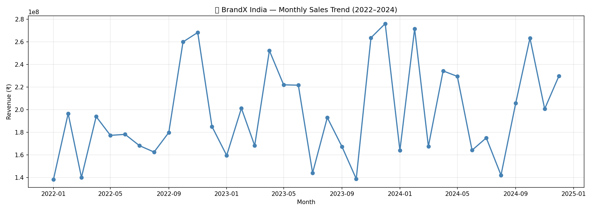
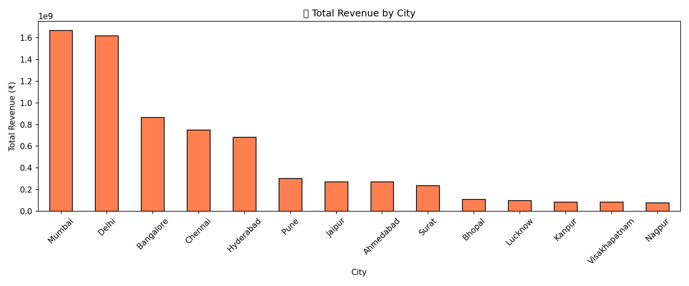
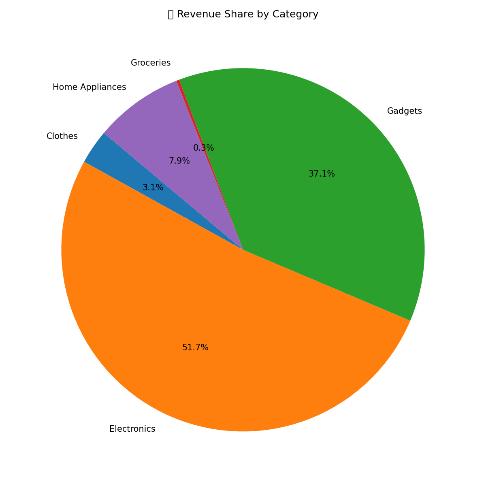
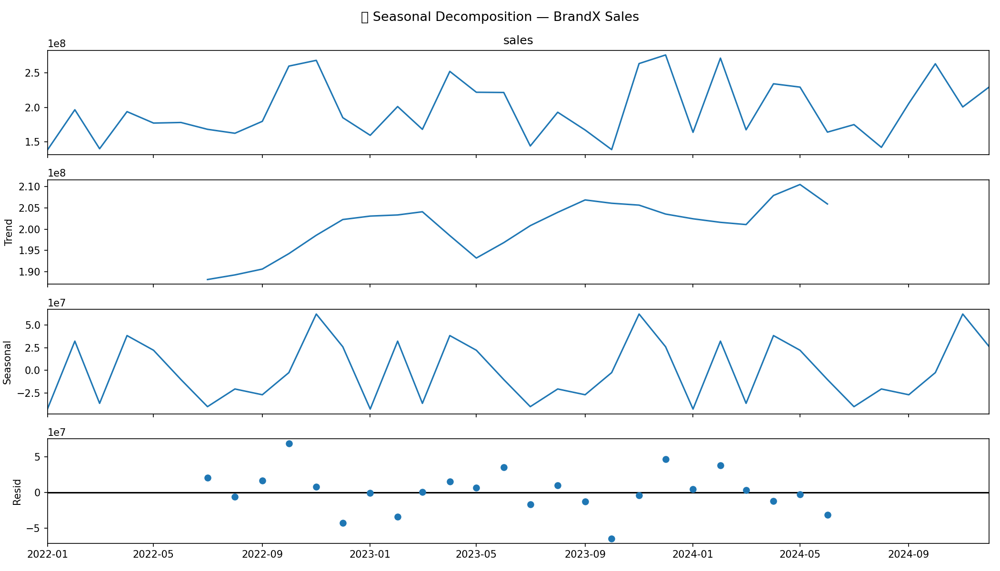
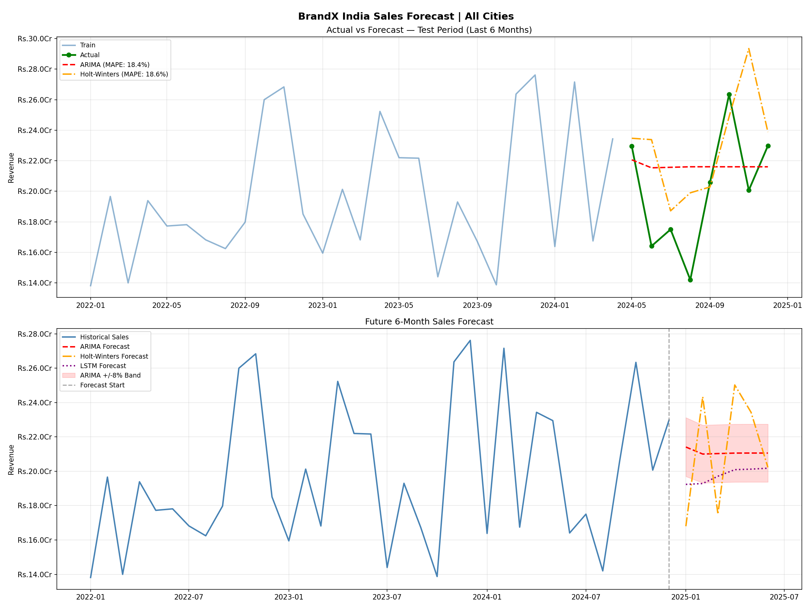

# Sales Forecasting — BrandX India Store Dataset

A complete end-to-end **Time Series Sales Forecasting** project built in Python using real-world Indian retail store data from the **BrandX India Store Dataset** (Kaggle). The project includes data loading, feature engineering, multiple forecasting models, evaluation, EDA charts, and an interactive Streamlit dashboard.

---

## Live Demo

> Run locally with:
> ```bash
> streamlit run dashboard.py
> ```

---

## Project Structure

```
SalesForecasting/
|
├── data/
│   └── brandx/
│       └── BrandX_India_Inventory_Dataset_2022_2024.csv
|
├── src/
│   ├── __init__.py
│   ├── data_loader.py           # Load & preprocess BrandX CSV
│   ├── feature_engineering.py   # Lag, rolling, festive features
│   ├── model.py                 # ARIMA, Holt-Winters, Prophet, LSTM
│   ├── evaluate.py              # MAE, RMSE, MAPE metrics
│   └── eda.py                   # EDA charts & visualisations
|
├── tests/
│   └── test_model.py            # Unit tests
|
├── main.py                      # Main pipeline entry point
├── run_eda.py                   # Run EDA charts
├── inspect_data.py              # Quick dataset inspection
├── dashboard.py                 # Streamlit interactive dashboard
├── set_env.py                   # Suppress TF warnings
└── requirements.txt             # All dependencies
```

---

## Dataset

| Field | Details |
|-------|---------|
| **Name** | BrandX India Inventory Dataset 2022–2024 |
| **Source** | [Kaggle — laxdippatel/brandx-india-store-dataset](https://www.kaggle.com/datasets/laxdippatel/brandx-india-store-dataset) |
| **Rows** | 5,121 |
| **Columns** | 47 |
| **Coverage** | 14 Indian cities, 1,179 stores, Jan 2022 – Dec 2024 |
| **Key columns** | `Revenue`, `City`, `Category`, `Month`, `Year`, `Store_ID` |

### Cities Covered
`Mumbai` · `Delhi` · `Bangalore` · `Chennai` · `Hyderabad` · `Pune` · `Ahmedabad` · `Jaipur` · `Surat` · `Bhopal` · `Kanpur` · `Nagpur` · `Lucknow` · `Visakhapatnam`

---

## Setup & Installation

### 1. Clone the repository
```bash
git clone https://github.com/shreyansh30/SalesForecasting.git
cd SalesForecasting
```

### 2. Create a virtual environment
```bash
python -m venv venv
venv\Scripts\activate.bat      # Windows CMD
# source venv/bin/activate     # Mac/Linux
```

### 3. Install dependencies
```bash
pip install --upgrade pip
pip install -r requirements.txt
```

### 4. Download the dataset
```bash
# Requires Kaggle API key at ~/.kaggle/kaggle.json
kaggle datasets download -d laxdippatel/brandx-india-store-dataset -p data/
tar -xf data/brandx-india-store-dataset.zip -C data/brandx/
```

---

## How to Run

```bash
# Inspect the dataset columns
python inspect_data.py

# Run the full forecasting pipeline
python main.py

# Run Exploratory Data Analysis (generates PNG charts)
python run_eda.py

# Launch the interactive Streamlit dashboard
streamlit run dashboard.py

# Run unit tests
python -m pytest tests/ -v
```

---

## Models Used

| Model | Library | Type | Best For |
|-------|---------|------|----------|
| **ARIMA** | `statsmodels` | Statistical | Trend + short-term patterns |
| **Holt-Winters** | `statsmodels` | Statistical | Seasonal monthly data |
| **Prophet** | `prophet` (Meta) | Statistical | Seasonality + holidays |
| **LSTM** | `tensorflow/keras` | Deep Learning | Non-linear patterns |

---

## Results

All models are evaluated on the last 20% of the time series (test set):

| Model | MAE | RMSE | MAPE |
|-------|-----|------|------|
| ARIMA | Rs. 3.27 Cr | Rs. 3.97 Cr | 18.39% |
| Holt-Winters | Rs. 3.29 Cr | Rs. 4.64 Cr | 18.63% |
| Prophet / HW | Rs. 3.30 Cr | Rs. 4.17 Cr | 17.38% |
| **LSTM** | **Rs. 2.93 Cr** | **Rs. 3.62 Cr** | **15.71%** ✅ Best |

> MAPE of 15–18% is **acceptable** for real-world retail forecasting with only 36 monthly data points.

---

## EDA Charts Generated

| File | Description |
|------|-------------|
| `eda_sales_trend.png` | Monthly revenue trend (2022–2024) |
| `eda_city_sales.png` | Total revenue by Indian city |
| `eda_category_sales.png` | Revenue share by product category |
| `eda_decomposition.png` | Trend + Seasonality + Residual decomposition |

### Sales Trend


### City-wise Revenue


### Category Breakdown


### Seasonal Decomposition


---

## Forecast Chart



---

## Feature Engineering

The following features are created from the monthly time series:

| Feature | Description |
|---------|-------------|
| `month`, `quarter`, `year` | Calendar features |
| `is_festive_month` | 1 for Oct/Nov/Mar/Sep (Diwali, Holi, Navratri) |
| `india_fy_quarter` | Indian Financial Year quarter (Apr = Q1) |
| `is_summer`, `is_winter` | Seasonal flags |
| `lag_1`, `lag_2`, `lag_3`, `lag_6` | Previous month sales |
| `rolling_mean_3`, `rolling_mean_6` | Rolling average over 3 and 6 months |
| `rolling_std_3`, `rolling_std_6` | Rolling std deviation |

---

## Configuration

Edit the `CONFIG` section in `main.py` to customise the run:

```python
DATA_DIR       = "data/brandx"
CITY           = None        # e.g. "Mumbai" — None = all cities
STORE_ID       = None        # e.g. "S001"   — None = all stores
FREQ           = "MS"        # "MS"=monthly, "QS"=quarterly
FORECAST_STEPS = 6           # months to forecast ahead
ARIMA_ORDER    = (2, 1, 1)
LSTM_SEQ_LEN   = 6
LSTM_EPOCHS    = 100
```

---

## Tech Stack


| Package | Purpose |
|---------|---------|
| `pandas`, `numpy` | Data manipulation |
| `matplotlib`, `seaborn` | Static visualisations |
| `plotly` | Interactive charts (dashboard) |
| `scikit-learn` | Preprocessing & metrics |
| `statsmodels` | ARIMA, Holt-Winters |
| `prophet` | Meta's forecasting library |
| `tensorflow`, `keras` | LSTM deep learning model |
| `streamlit` | Interactive web dashboard |

---

## License

This project is open source and available under the [MIT License](LICENSE).

---

## Author

**Shreyansh** — [@shreyansh30](https://github.com/shreyansh30)

> Built as a real-world Data Science project using Indian retail store data.
